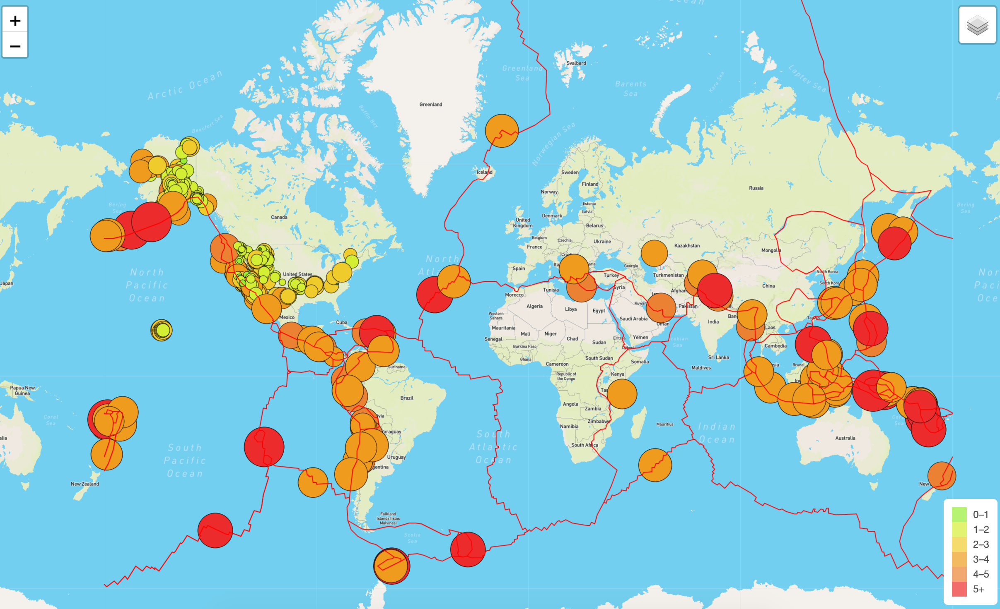

# Mapping Earthquakes

Purpose: Map multiple GeoJSON Points that represented earthquakes in the past 7 days using leaflet map to add multiple tile layers and adding overlays.

Applications used:
- Visual Studio
- Leaflet
- d3 library

Data stored as JSON

Language:
JS
HTML
CSS
